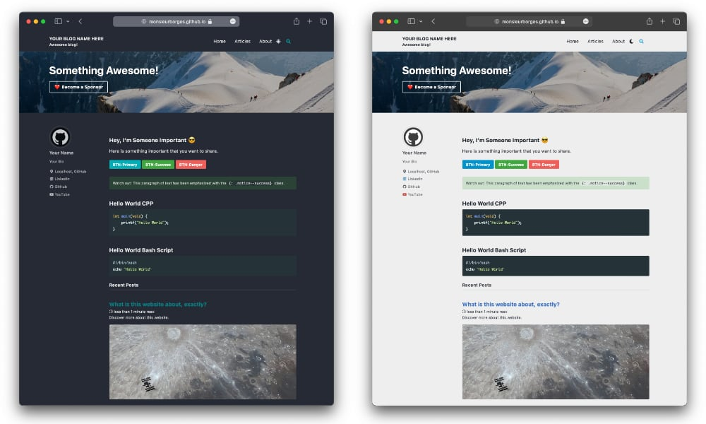

# GitHub Page Template

A simple, clean, and responsive theme for your website or blog.

If you like this template, give it a star ⭐️

Site demo: https://monsieurborges.github.io/site-template

Built on [Jekyll](https://jekyllrb.com) & [Minimal Mistakes](https://github.com/mmistakes/minimal-mistakes) ❤️

## ✅ Getting Started

**[Fork this template](https://github.com/monsieurborges/site-template/fork)**, then rename the repo to `USERNAME.github.io`, replacing `USERNAME` with your GitHub username.

## 📚 Documentation

For detailed instructions on how to configure, customize, add content, and more check [Minimal Mistakes Start Guide](https://mmistakes.github.io/minimal-mistakes/docs/quick-start-guide/).

For more details on how to set things up check [Getting started with GitHub Pages](https://docs.github.com/pages).

Want to learn more about Jekyll? Check out this [tutorial](https://www.taniarascia.com/make-a-static-website-with-jekyll/).
